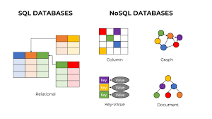
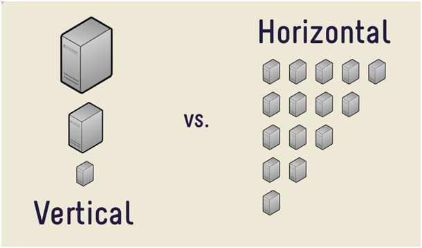

<h2>SQL, NoSQL, & Object Oriented Databases</h2>

<h3>SQL</h3>

SQL (Structured Query Language) is the language used to communicate with Relational Databases. Some examples of Relational Databases are Oracle, Sybase, and Mircrosoft SQL. They use a predefined schema of tables that contain rows and columns to store data. SQL databases are reliable and widely used, but the predefined schema can be restrictive. You really need to know what you want it to do and how you want it to look before you get started.

<h3>NoSQL</h3>

NoSQL is organized differently. They are flexible. They have no predefined schema and data can be stored in a number of ways: columns, graphs, documents or key value Some examples of NoSQL databases are MongoDB, Redis, and Cassandra. 

Another difference between SQL and NoSQl is scalability. SQL databases are vertically scalable while NoSQL ones are horizontially scalable. This can play a part in which database you should use. Vertical scaling is restricted to one machanie and therefore has limits. With horizontal scaling you can add more machines. 

<h3>Object Oriented</h3>

Explain the main features of each type of database.
When would you use each type?
What are the differences?
What are the advantages and disadvantages?

