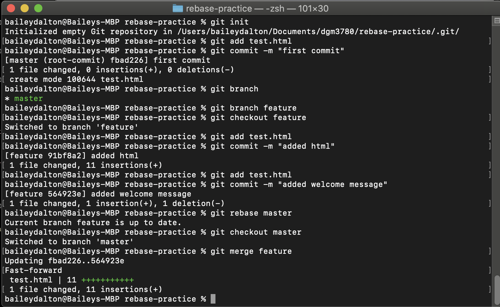
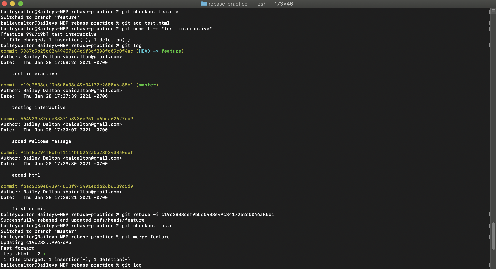
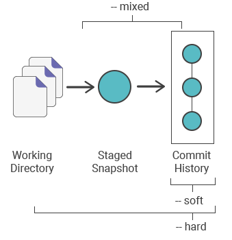
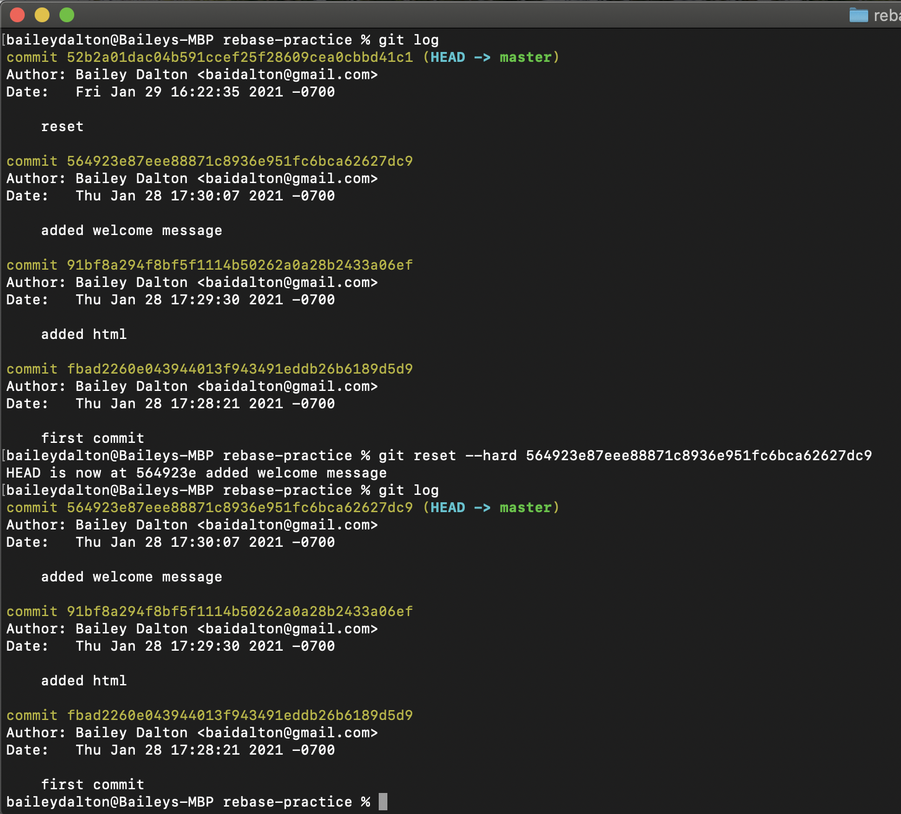
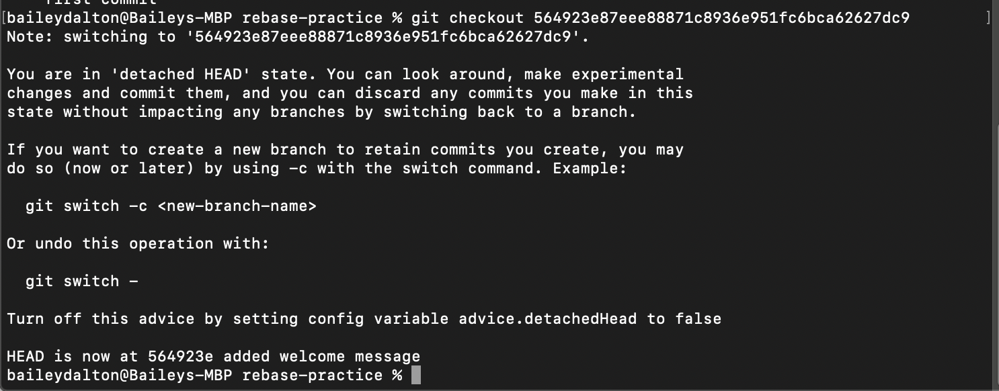
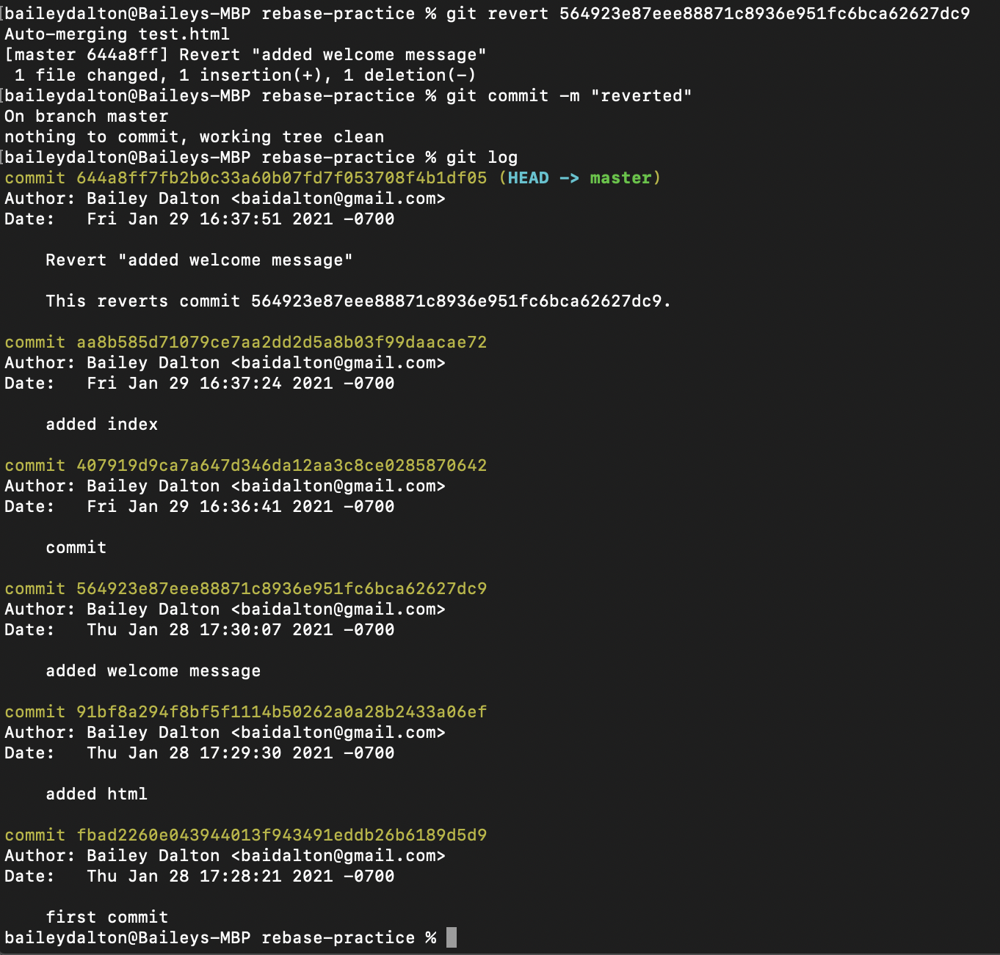

Advanced Git

Git rebase allows you to combine commits from a branch onto another. It is changing the base of your branch so you have a continuous, linear project. Say you create a new branch and make a few commits. You can then use git rebase and this changes the base of your project to the master and puts your branch however many commits ahead of the master branch. You can then perfrom git merge branch from the master branch and this will perform a fast-forward merge. You shouldn't use rebase on a shared branch or open source project. It can create a lot of conflicts. 

Advantages 

- A clean history
- Easier to rollback and look for bugs

Disadvantages

- Will break your build if a dependency is used on the branch and not on the master
- Easy to create conflicts 

A rebase merge

An interactive rebase merge

When you shouldn't rebase with a remote repo.

When you are working on a team with a remote repo you need to understand how rebasing works so you don't loose any code. You will always want to pull before you rebase so you are up to date. If there are commits on the master from teammates and you decide to rebase and then pull you will loose code and create lots of conflicts.

Git reset

Git reset moves the HEAD and branch ref pointers to the commit you specify. There are three arguments, --soft, --mixed, --hard. --mixed is the default. Soft will reset your commit history, but not your working directory or staging area. Mixed will reset your commit history and staging area. And hard will reset all three which is why it is the most dangerous but also the most used.

Git checkout will switch where you are working. You can checkout a branches and commits. 

Git revert?

Instead of moving the HEAD and branch ref pointers, reverts the changes form that commit and appends a new commit with the reverted changes. 

Differences

Reset
- Alters history
- Not as safe (deleting code)
- Moves HEAD and branch ref pointers

Revert
- Doesn't alter history
- Safe option for shared repository (won't loose code becuase it doesn't delete anything)
- Doesn't move head and branch ref pointers

When would you use reset, checkout, or revert? Why?

You would use reset when you want to delete commits up to a certain commit and are okay with losing that work.

You would use revert when you want to keep some commits but want to delete one certain commit.

You use checkout to work on a different branch or to checkout a commit.

git reset 

get checkout

git revert

git submodules

Answer the following questions:

What are git submodules?
A submodule is a repository inside of a repository.
When would you use a submodule?
You could use a submodule when you have a large project, or, I use submodules to directly access different projects on my portfolio site.
What are the advantages and disadvantages of git submodules?