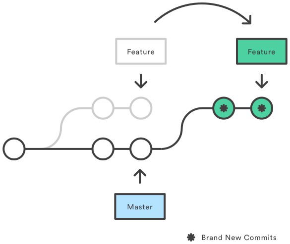

Advanced Git

Git rebase allows you to combine commits from a branch onto another. It is changing the base of your branch so you have a continuous, linear project. Say you create a new branch and make a few commits. You can then use git rebase and this changes the base of your project to the master and puts your branch however many commits ahead of the master branch. You can then perfrom git merge branch from the master branch and this will perform a fast-forward merge.

Some of the advantages of git rebase is having a clean git log history. This makes debugging easier. You can rollback to a previous commit and to see where the bug began easier becuase of you have a clean history.

Advantages 

> A clean history
> Easier to rollback and look for bugs

One disadvantage is when you are using a dependency on a branch that has been removed on master. When you rebase on to master this will break your build. 

You shouldn't use git rebase on a public repository, an open source project or a shared branch becuase it is easy to lose code. 

A rebase merge

An interactive rebase merge

When you shouldn't rebase with a remote repo.

Answer the following questions:

What is git reset?

Git reset resets your 
What is the difference between hard, mixed and soft?
What is git checkout? 

Git checkout will switch where you are working. You can checkout a branches and commits. 

What is git revert?
In what ways are these commands the same and what ways are they different?
When would you use reset, checkout, or revert? Why?
Create a new repo and demonstrate your knowledge of the following items with screenshots:

a git reset
a get checkout
a commit
a file
a get revert
git submodules
Answer the following questions:

What are git submodules?
A submodule is a repository inside of a repository.
When would you use a submodule?
You could use a submodule when you have a large project, or, I use submodules to directly access different projects on my portfolio site.
What are the advantages and disadvantages of git submodules?