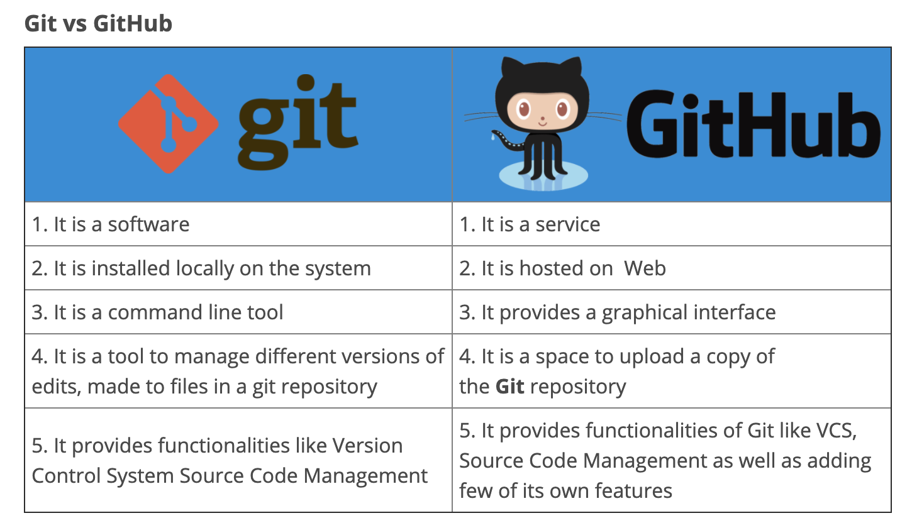

Git

Git is a verison control system that helps you keep your code organized and keep track of code history. It was devleoped in 2005 and is known for it's branching model. Git is an important tool in web development becuase it supports branching and merging. You can create branches and work on a feature independent of the main project then merge it in. This solved the problem of only one person being able to work on a branch at a time. 

Github is a cloud based service that helps you mange your git repositories. Github has a lot of advantages. You can access your code from anywhere on any computer and, if you allow, any one else has access to you code aswell. 

Git is a software used locally and GitHub is a service that is hosted on the web. They are two seperate tools that can be used together. 

